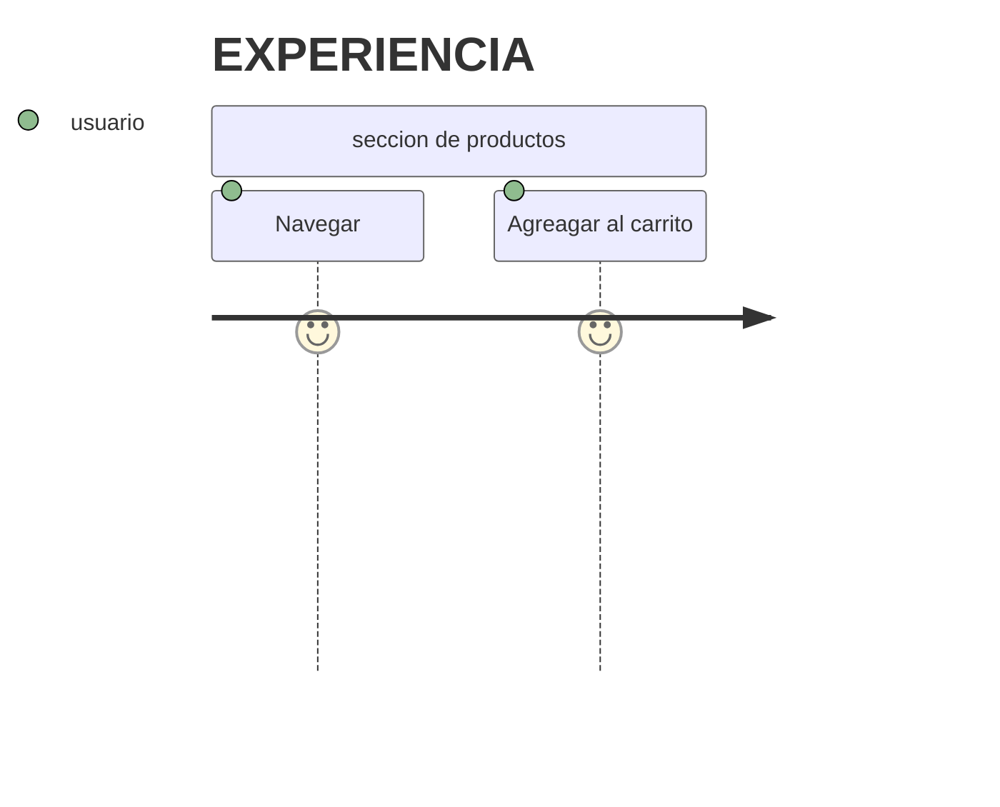
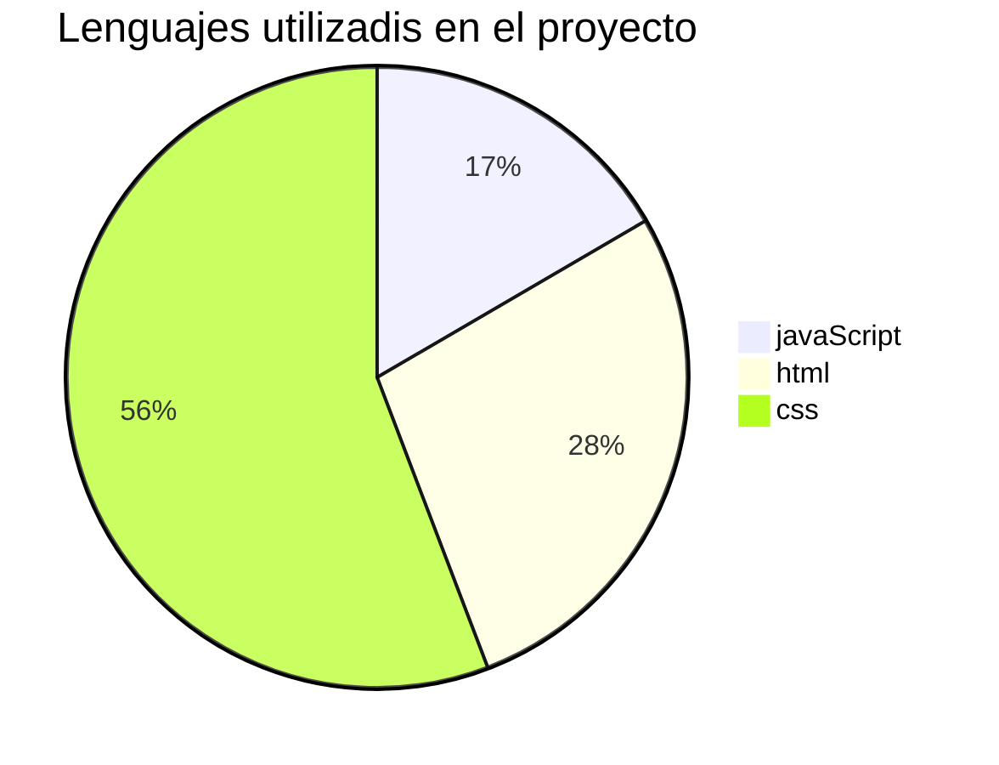

# Cacao & Alma – Chocolatería Artesanal

[](https://github.com/NickyNicoleP/Chocolateria-Pagina-Web)
[](LICENSE)

Sitio web elegante y responsivo para una chocolatería artesanal de lujo.  
Muestra productos, historia de la marca y permite simular un carrito de compras con notificaciones interactivas.

 

---

## Identidad visual & paleta de colores

La experiencia visual está inspirada en el cacao, la calidez de los Andes y la sofisticación artesanal.

| Color | Nombre | Uso principal | Código HEX |
|-------|--------|---------------|------------|
| <span style="background-color:#3D1F16; width:20px;height:20px;display:inline-block;"></span> | *Chocolate oscuro* | Fondos, textos principales, botones | #3D1F16 |
| <span style="background-color:#6B3A2A; width:20px;height:20px;display:inline-block;"></span> | *Chocolate claro* | Degradados, detalles | #6B3A2A |
| <span style="background-color:#B8973A; width:20px;height:20px;display:inline-block;"></span> | *Oro artesanal* | Acentos, bordes, elementos destacados | #B8973A |
| <span style="background-color:#D4B05A; width:20px;height:20px;display:inline-block;"></span> | *Oro brillante* | Hovers, variaciones del oro | #D4B05A |
| <span style="background-color:#FAF6F0; width:20px;height:20px;display:inline-block;"></span> | *Crema* | Fondo general, tarjetas de productos | #FAF6F0 |
| <span style="background-color:#F2EBE0; width:20px;height:20px;display:inline-block;"></span> | *Hueso* | Secciones alternas (productos) | #F2EBE0 |
| <span style="background-color:#2A1208; width:20px;height:20px;display:inline-block;"></span> | *Textura cacao* | Textos, sombras, degradados profundos | #2A1208 |
| <span style="background-color:#7A5C4E; width:20px;height:20px;display:inline-block;"></span> | *Marrón suave* | Textos secundarios, descripciones | #7A5C4E |

### Aspectos visuales destacados

- *Tipografía elegante*:  
  - Playfair Display para títulos (serif con carácter).  
  - Cormorant Garamond para subtítulos y textos narrativos (estilo itálico).  
  - Jost para textos funcionales (navbar, botones, footer).

- *Fondo del Hero*:  
  Degradado radial + lineal que simula la profundidad del chocolate, con círculos dorados sutiles en SVG.

- *Efectos de vidrio (glassmorphism)*:  
  Navbar con backdrop-filter: blur(18px) y fondo semitransparente.

- *Animaciones*:  
  - fade-up al hacer scroll (aparición suave con retardo escalonado).  
  - Botones con subrayado animado y cambio de color.  
  - Ícono de scroll flotante en el hero.  
  - Cubo 3D giratorio en el footer (efecto original).

- *Tarjetas de producto*:  
  - Imagen con zoom al hover.  
  - Borde sutil y sombra elevada.  
  - Etiquetas ("Bestseller", "Edición Especial", "Nuevo").

- *Toasts (notificaciones)*:  
  Aparecen desde la parte inferior con borde lateral dorado, estilo minimalista.

- *Diseño responsive*:  
  La navegación se adapta, y en móviles (<480px) los enlaces del navbar se ocultan (se puede agregar menú hamburguesa después).

---

## Características funcionales

- *Carrito simulado* – Botones “Añadir” actualizan contador y muestran toast.  
- *Newsletter* – Validación de email (frontend).  
- *Scroll suave* – Navegación interna fluida.  
- *Animaciones al scroll* – Usando IntersectionObserver.  

---


## Tecnologías utilizadas

- *HTML5, **CSS3* (variables, grid, flex, keyframes), *JavaScript vanilla*.  
- *Google Fonts*.  
- *Git & GitHub*.

---
---

```bash
## Estructura del proyecto
📦Chocolateria-Pagina-Web/
├──🗂️imagenes
|  ├──imagenes1.JPG
|  ├──imagenes2.JPG
|  ├──imagenes3.JPG
|  └──imagenes4.JPG
├──🖼️Chocolate1.JPG
├──🖼️Chocolate2.JPG
├──🖼️Chocolate3.jpg
├──🖼️LOGO.PNG
├──📄styles.css
├──📄main.js
├──📄main.html
└──📄readme.md
```

## 🚀 Cómo probar localmente

```bash
git clone https://github.com/NickyNicoleP/Chocolateria-Pagina-Web.git
cd Chocolateria-Pagina-Web
# Abre index.html con Live Server o directamente en el navegador
```